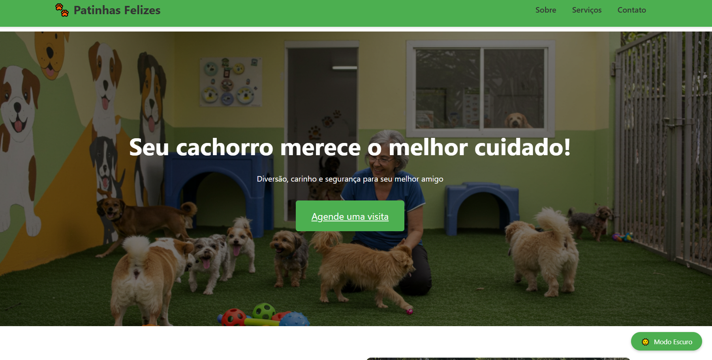
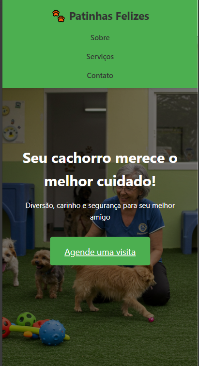
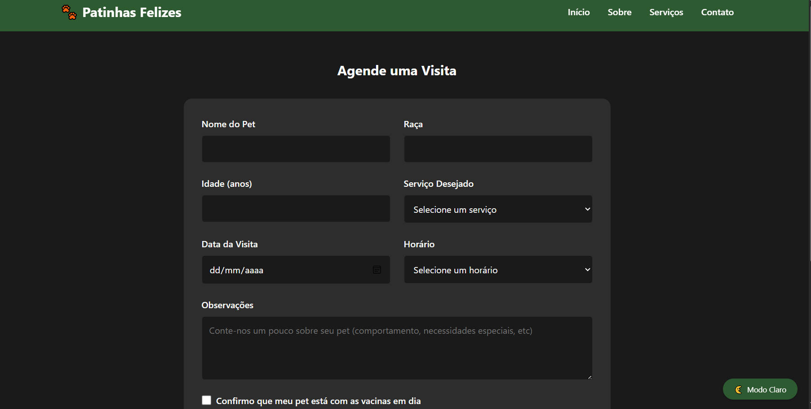

# 📑 Documentação do Projeto Creche de Cachorros

## 📋 Visão Geral
Este documento detalha a estrutura, funcionalidades e implementação do website da Creche de Cachorros.

## 🖥️ Interface do Usuário

### Página Inicial
A página inicial apresenta os principais serviços da creche, destaques e informações de contato.



### Visualização Mobile
O website é totalmente responsivo, adaptando-se perfeitamente a dispositivos móveis.



### Sistema de Agendamento
A página de agendamento permite aos clientes marcarem visitas e serviços.



## 🔧 Estrutura do Projeto

### Arquivos Principais
- `index.html`: Página inicial
- `agendamento.html`: Sistema de agendamento
- `styles/`: Pasta contendo arquivos CSS
- `scripts/`: Pasta contendo arquivos JavaScript
- `images/`: Pasta contendo todas as imagens do projeto

### Tecnologias Utilizadas
- HTML5 para estruturação
- CSS3 para estilização e responsividade
- JavaScript vanilla para interatividade
- Imagens do Unsplash

## 📱 Compatibilidade
O website foi testado e é compatível com:
- Google Chrome
- Mozilla Firefox
- Safari
- Microsoft Edge
- Dispositivos móveis Android e iOS

## 🔄 Atualizações Futuras
- Implementação de sistema de login para clientes
- Área administrativa para gerenciamento de agendamentos
- Sistema de avaliações e feedback

## 1. Configuração Inicial do Projeto

### 1.1 Criação do Repositório no GitHub
1. Acessamos o GitHub e criamos um novo repositório chamado "creche-cachorros"
2. Inicializamos com um README.md
3. Escolhemos a licença MIT para permitir uso livre do código

### 1.2 Clonagem e Configuração Local
```bash
git clone https://github.com/er1carruda/creche-cachorros.git
cd creche-cachorros
```

### 1.3 Estrutura Inicial do Projeto
```
creche-cachorros/
├── index.html
├── agendamento.html
├── styles.css
├── agendamento.css
├── script.js
├── images/
├── README.md
└── .gitignore
```

## 2. Desenvolvimento do Projeto

### 2.1 Tecnologias Utilizadas
- HTML5 para estrutura semântica
- CSS3 para estilização moderna
- JavaScript vanilla para interatividade
- Git para controle de versão
- Vercel para deploy

### 2.2 Funcionalidades Implementadas
1. **Página Inicial**
   - Hero section com chamada para ação
   - Seção "Sobre Nós"
   - Cards de serviços
   - Formulário de contato

2. **Página de Agendamento**
   - Formulário de agendamento
   - Validação de dados
   - Resumo do agendamento

3. **Recursos Globais**
   - Tema claro/escuro
   - Design responsivo
   - Navegação suave
   - Efeitos de transição

### 2.3 Escolhas de Design

#### Paleta de Cores
- **Principal**: #4CAF50 (Verde)
  - Representa natureza e vida
  - Transmite tranquilidade e confiança
- **Secundárias**:
  - Branco (#FFFFFF) para clareza
  - Cinza escuro (#333333) para texto
  - Verde escuro (#2d5a30) para contraste

#### Tipografia
- Fonte principal: 'Segoe UI'
- Fontes alternativas: Tahoma, Geneva, Verdana
- Escolhidas por legibilidade e modernidade

#### Layout
- Design responsivo com Grid e Flexbox
- Espaçamento generoso para melhor leitura
- Cards interativos para engajamento
- Menu fixo para fácil navegação

## 3. Versionamento com Git

### 3.1 Estratégia de Branches
- `main`: código em produção
- `develop`: desenvolvimento contínuo
- `feature/*`: novas funcionalidades
- `hotfix/*`: correções urgentes

### 3.2 Histórico de Versões

#### v1.0.0 - Base do Projeto
```bash
git tag -a v1.0.0 -m "Lançamento inicial do site"
```
- Estrutura HTML básica
- Estilos CSS fundamentais
- JavaScript para interações básicas

#### v1.1.0 - Tema Escuro
```bash
git tag -a v1.1.0 -m "Implementação do tema escuro"
```
- Toggle de tema
- Variáveis CSS
- Persistência de preferências

#### v1.1.1 - Correções
```bash
git tag -a v1.1.1 -m "Correções no tema escuro"
```
- Bugs da página de agendamento
- Melhorias visuais

#### v1.1.2 - Aprimoramentos
```bash
git tag -a v1.1.2 -m "Melhorias no sistema de temas"
```
- Refatoração do código
- Otimização de performance

#### v1.1.3 - Otimizações
```bash
git tag -a v1.1.3 -m "Otimização de JavaScript"
```
- Código modular
- Correção de erros

#### v1.1.4 - Documentação Visual
```bash
git tag -a v1.1.4 -m "docs: adiciona capturas de tela na documentação"
```
- Adição de capturas de tela do projeto
- Documentação visual da interface
- Organização da galeria de fotos

### 3.3 Commits Semânticos
Utilizamos o padrão de commits semânticos:
- `feat`: novas funcionalidades
- `fix`: correções de bugs
- `docs`: documentação
- `style`: formatação
- `refactor`: refatoração
- `perf`: performance

## 4. Deploy no Vercel

### 4.1 Configuração do Vercel
1. Criação da conta no Vercel
2. Conexão com o repositório GitHub
3. Configuração do projeto:
   - Framework Preset: None
   - Build Command: None
   - Output Directory: ./

### 4.2 Deploy Automático
- Configurado deploy automático a cada push
- Preview deployments para pull requests
- Domínio personalizado configurado

## 5. Links do Projeto

### 5.1 Repositório
- GitHub: [https://github.com/er1carruda/creche-cachorros](https://github.com/er1carruda/creche-cachorros)

### 5.2 Site em Produção
- Vercel: [https://creche-cachorros.vercel.app](https://creche-cachorros.vercel.app)

## 6. Capturas de Tela

### 6.1 Página Inicial

- Design moderno e intuitivo
- Apresentação clara dos serviços
- Interface amigável e acolhedora

### 6.2 Versão Mobile

- Layout adaptativo
- Menu responsivo
- Experiência otimizada para dispositivos móveis

### 6.3 Sistema de Agendamento

- Formulário interativo
- Interface simplificada
- Processo de agendamento intuitivo

## 7. Próximos Passos

### 7.1 Melhorias Planejadas
- Implementação de testes
- Otimização de imagens
- Melhorias de SEO
- Backend para agendamentos
- Sistema de notificações

### 7.2 Manutenção Contínua
- Monitoramento de performance
- Atualizações de segurança
- Feedback dos usuários
- Análise de métricas

## 8. Conclusão

O projeto Patinhas Felizes demonstra a aplicação de boas práticas de desenvolvimento web, desde a concepção até o deploy. A escolha de tecnologias modernas, combinada com um processo de versionamento robusto e uma estratégia de deploy eficiente, resultou em um produto final de qualidade.

A documentação detalhada e o histórico de versões permitem que outros desenvolvedores entendam facilmente o projeto e contribuam para seu desenvolvimento futuro. 
