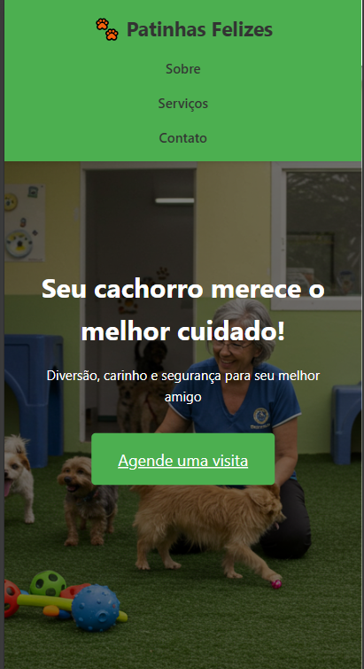
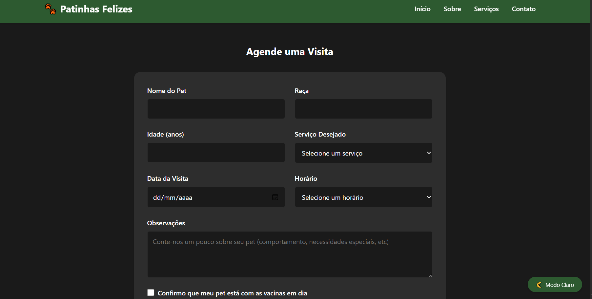

# 🐕 Creche de Cachorros - Website

Este é um website responsivo para uma creche de cachorros fictícia, desenvolvido com HTML, CSS e JavaScript puro.

## 🚀 Funcionalidades

- Página inicial com informações sobre os serviços
- Seção "Sobre Nós" com a história da creche
- Galeria de fotos dos pets
- Sistema de agendamento de visitas
- Design responsivo para todos os dispositivos

## 💻 Tecnologias Utilizadas

- HTML5
- CSS3
- JavaScript
- Imagens do Unsplash

## 🛠️ Como Executar

1. Clone este repositório
2. Abra o arquivo `index.html` em seu navegador
3. Explore o site e suas funcionalidades

## 📱 Páginas Disponíveis

- Home (`index.html`)
- Agendamento (`agendamento.html`)

## 📸 Capturas de Tela

### Página Inicial

### Versão Mobile

### Página de Agendamento

### Galeria de Fotos
.jpg)
.jpg)
.jpg)
.jpg)

## 📝 Licença

Este projeto está sob a licença MIT. 